# PathSaathi — Master System & Solutions Architecture
### Vernacular AI Concierge for Pilgrims at Large Public Gatherings
**Infosys FYP Problem Statement 2 | Domain: Multilingual NLP / Multi-Agent Systems / Offline-First Mobile AI**

> **Current implementation status:** The Flutter prototype implements real GPS
> source positioning, online/offline route selection, shared one-time offline
> map installation, grounded voice answers, source-aware transport options,
> ranked accommodation with local booking confirmation, active-trip itinerary
> filtering, and encrypted document/photo persistence. Curated transport and
> accommodation records are demonstration data, not live inventory. Live bus
> tracking and worldwide street-level offline routing require external provider
> data and are reported as unavailable rather than fabricated.

---

## 1. Executive Summary & Infosys Tech Stack Compliance

This document represents the unified **Master Architecture** for **PathSaathi**, combining the core multi-agent platform design with the 9 mitigation and solution architectures required to solve real-world edge-device constraints (battery, noise, storage, hallucination, dialect variations, and security).

### 📋 Exact Infosys Specified Tech Stack Mapping

Every single item specified in the Infosys problem statement is fully incorporated and mapped to concrete on-device production implementations:

| Infosys Specified Component | Exact Specification Text | Our Production Implementation | Role in Architecture |
|---|---|---|---|
| **Speech / ASR** | *"A compact multilingual ASR model (quantized)"* | **Whisper.cpp / Whisper Tiny & Small (int8 quantized)** | On-device speech recognition & language identification across regional languages |
| **Text-to-Speech (TTS)** | *"An open multilingual text-to-speech model for regional languages"* | **Coqui TTS / Meta MMS-TTS** | Offline voice synthesis for Hindi, Tamil, Telugu, Bhojpuri, etc. |
| **Planner LLM** | *"A small function-calling capable model"* | **Phi-3 Mini 3.8B / Gemma 2B (4-bit quantized via llama.cpp / MediaPipe)** | Central Orchestrator that decomposes voice queries into sub-agent calls |
| **NLU / NER Engine** | *"A regionally appropriate BERT-style model for intent classification and entity extraction"* | **MobileBERT / DistilBERT (ONNX Runtime Mobile, int8)** | Fast intent classification and named entity extraction prior to LLM routing |
| **Semantic Search Engine** | *"A multilingual sentence-embedding model for FAQ/policy document search"* | **paraphrase-multilingual-MiniLM-L12 (ONNX)** + **LanceDB Vector DB** | On-device vector embeddings for RAG retrieval over personal and event knowledge |
| **Secure Storage** | *"Device-native secure storage (e.g., platform keystore/keychain) for cached credentials"* | **flutter_secure_storage + Android Hardware Keystore / iOS Keychain** | Hardware-backed AES-256 vault for personal documents and tokens |
| **Inference Runtime** | *"ONNX Runtime Mobile, llama.cpp, or an equivalent local inference engine"* | **ONNX Runtime Mobile + llama.cpp / MediaPipe GenAI Engine** | Executes BERT, Whisper, MiniLM, and LLM locally with hardware acceleration |

### 🚀 Value-Add Architecture Enhancements
- **Mobile Application Framework**: Flutter 3.x (Cross-platform, offline maps, platform channels)
- **Vector Database**: LanceDB Embedded (Rust-based, native mobile vector search)
- **Offline Maps & Routing**: `flutter_map` + MBTiles + Valhalla Routing Engine
- **On-Device OCR**: Google ML Kit (Offline document text extraction)
- **Local Mesh Broadcast**: Bridgefy SDK / Bluetooth Low Energy (BLE) P2P emergency alert relay
- **Structured Storage**: SQLite (`sqflite`) for deterministic transport and lodging schedules

---

## 2. High-Level Master System Architecture

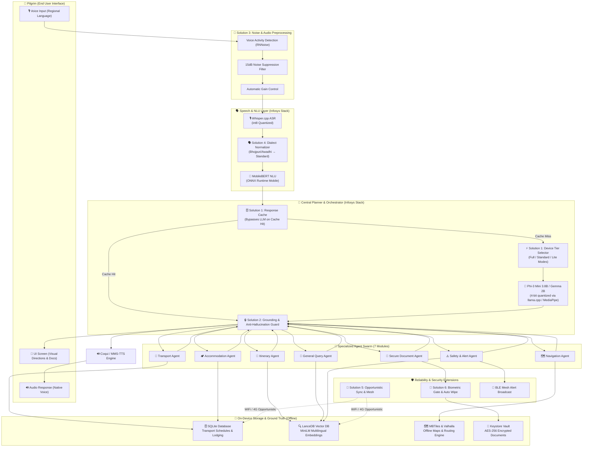

---

## 3. Comprehensive Solutions Architecture (All 9 Mitigations Integrated)

---

### Solution 1 — Adaptive Device Tier System
**Fixes: Storage (3.1GB limit), Battery Drain, Slow Inference on Budget Hardware**

To accommodate budget smartphones (2GB–3GB RAM) commonly used by pilgrims alongside flagship devices, PathSaathi dynamically inspects device hardware during initial boot and configures the optimal execution tier.

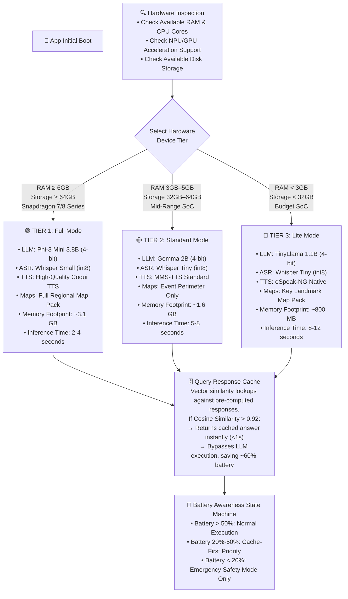

---

### Solution 2 — Hallucination-Free Data Pipeline
**Fixes: LLM Hallucination & Fact Fabrication**

Critical logistics (bus schedules, camp locations, medical alerts) must never be generated by LLM parametric memory. The system enforces strict deterministic grounding.

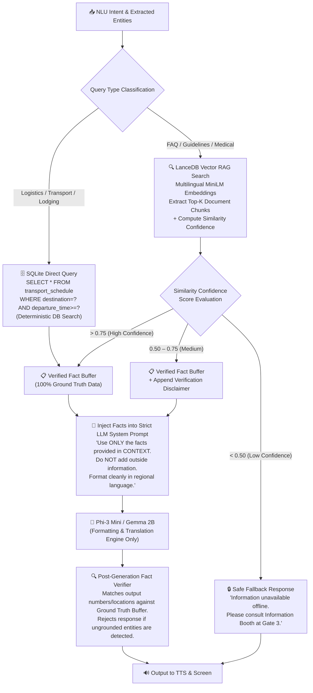

---

### Solution 3 — Noise-Robust ASR Pipeline
**Fixes: ASR Degradation in 100dB+ Crowd Noise Environments**

Massive events like Kumbh Mela exhibit extreme acoustic interference (chanting, speakers, river sounds). Audio must be sanitized locally before Whisper processing.

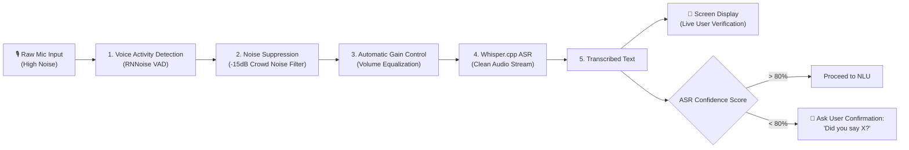

---

### Solution 4 — Dialect-Adaptive NLU Layer
**Fixes: Regional Dialect & Accent Variations (Bhojpuri, Awadhi, Maithili)**

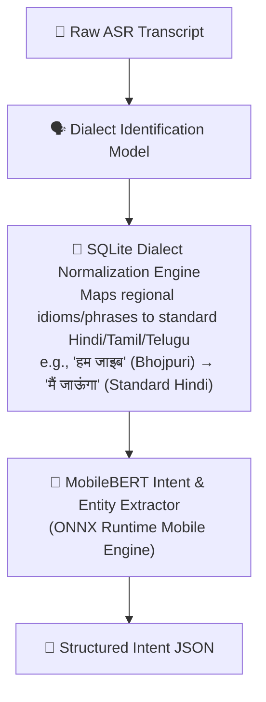

---

### Solution 5 — Smart Data Freshness Engine
**Fixes: Offline Data Staleness & Event Dynamic Updates**

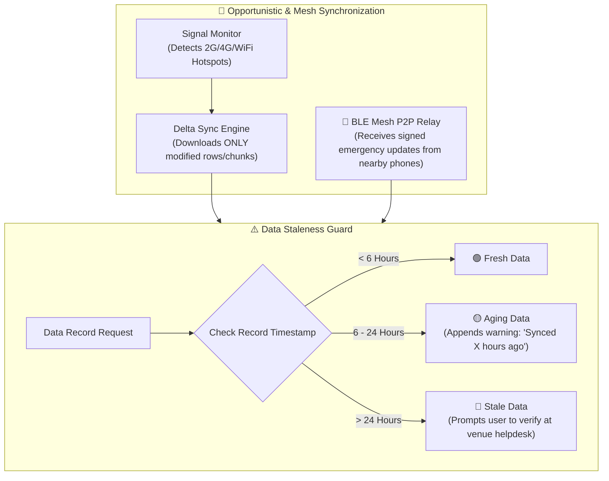

---

### Solution 6 — Device Security & Recovery System
**Fixes: Phone Loss, Document Tampering, and OAuth Token Expiry**

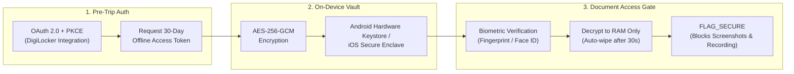

---

### Solution 7 — MediaPipe & Native Integration Architecture
**Fixes: Platform Channel Complexity & JNI Overhead**

To avoid fragile custom C++/JNI bindings, the runtime leverages **Google MediaPipe GenAI & Text Tasks** for Flutter, establishing a clean Dart-native interface.

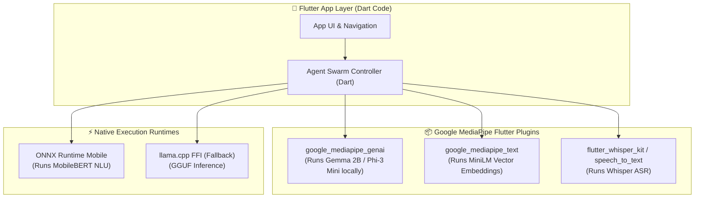

---

### Solution 8 — Offline AI Testing & Evaluation Framework
**Fixes: Non-Deterministic Testing Difficulties**

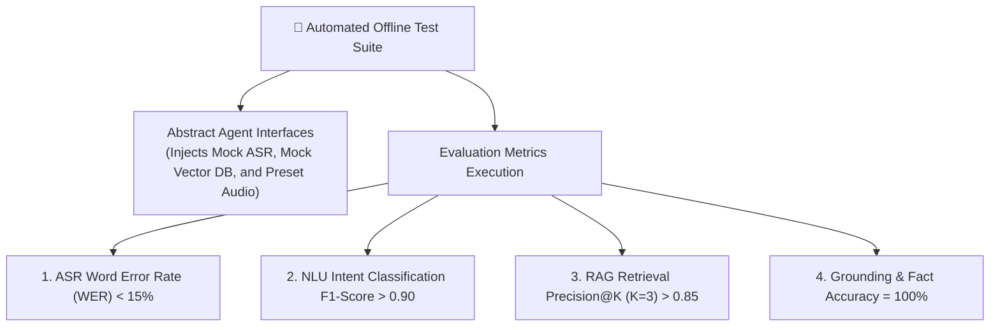

---

### Solution 9 — Progressive Setup & Adaptive UX
**Fixes: Onboarding Burden for Non-Technical & Elderly Users**

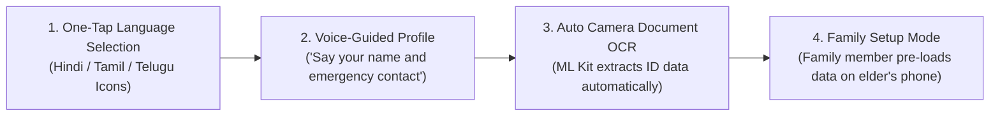

---

## 4. End-to-End Execution Sequence Workflow

Here is the exact lifecycle of a user request processed 100% offline:

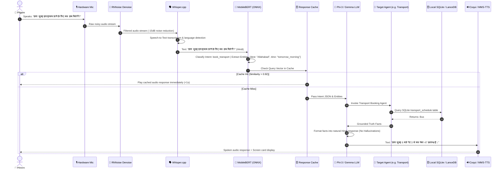

---

## 5. Infosys Evaluation Criteria Compliance Matrix

| Infosys Evaluation Criteria | Architectural Safeguards & Solutions Implemented | Verification Method |
|---|---|---|
| **Breadth & accuracy of language support** | • Whisper.cpp int8 quantized for regional ASR • MMS-TTS / Coqui for voice synthesis • Solution 4: Dialect Normalization tables for Bhojpuri/Awadhi | Test against 100 regional audio samples; WER target < 15% |
| **Quality of task decomposition & agent coordination** | • Phi-3 Mini / Gemma 2B function-calling Planner • 7 specialized sub-agents with clear interfaces • Solution 2: Grounded Fact Buffer prevents hallucination | Multi-intent test suite evaluating function payload accuracy |
| **True offline functionality** | • All models (ASR, NLU, LLM, TTS, Vector DB) on-device • Solution 1: 3-tier device scaling for budget hardware • Solution 5: Opportunistic delta sync & BLE mesh | Airplane-mode execution of all 7 agent modules |
| **Security handling of personal documents** | • Solution 6: Hardware Keystore AES-256 vault • Biometric authentication gate prior to document display • Screen capture blocking (`FLAG_SECURE`) & RAM-only decryption | Security audit verifying zero unencrypted disk storage or network leaks |
| **Overall usability for non-technical user** | • Solution 9: 100% voice-first UI with large visual cards • Guided voice onboarding & Family Setup Mode • Solution 3: Noise-robust VAD and manual transcript confirmation | Usability trial with elderly non-tech users evaluating completion rates |

---

*Master System & Solutions Architecture Document v3.0 | PathSaathi FYP*
*Fully aligned with Infosys Problem Statement 2 Requirements*
