# PathSaathi — Solutions & Mitigations Architecture
### Engineering Solutions for All 16 Identified Drawbacks
*FYP Documentation | Infosys Problem Statement 2*

---

## Solutions Overview Map

| Drawback | Solution Architecture |
|---|---|
| 🔴 Storage (3.1GB) + Battery drain + Slow inference | **Solution 1: Adaptive Device Tier System** |
| 🔴 LLM Hallucination | **Solution 2: Hallucination-Free Data Pipeline** |
| 🟠 Noisy crowd ASR | **Solution 3: Noise-Robust ASR Pipeline** |
| 🟠 Dialect variation | **Solution 4: Dialect-Adaptive NLU Layer** |
| 🟠 Stale offline data | **Solution 5: Smart Data Freshness Engine** |
| 🟠 Phone lost + OAuth expiry | **Solution 6: Device Security & Recovery System** |
| 🔴 Platform channel complexity | **Solution 7: MediaPipe Simplified Integration** |
| 🟠 Testing difficulty | **Solution 8: Offline AI Testing Framework** |
| 🟡 Setup burden + Language switching | **Solution 9: Progressive Setup & Adaptive UX** |

---

## Solution 1 — Adaptive Device Tier System
*Fixes: Storage (3.1GB), Battery Drain, Slow Inference on Budget Phones*

### Core Idea
Instead of one fixed set of models for all devices, detect the device
capability at install time and download the appropriate model tier.

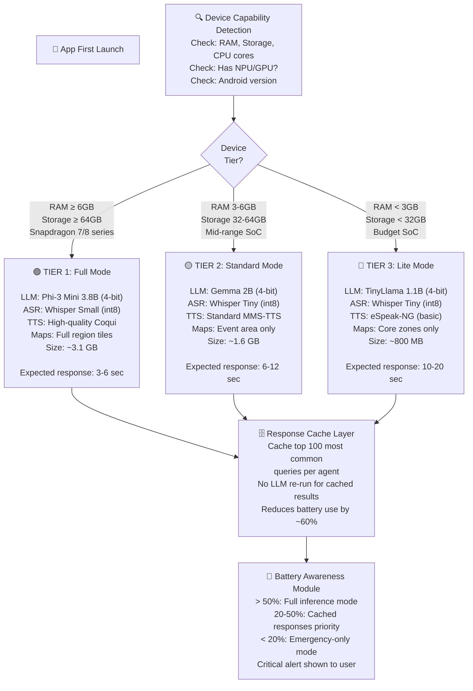

### Response Cache Architecture
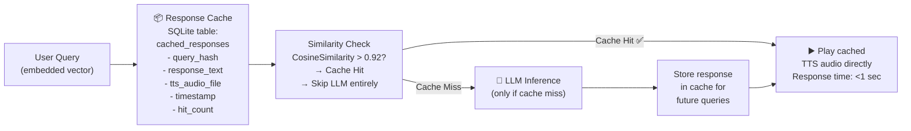

### Battery Management State
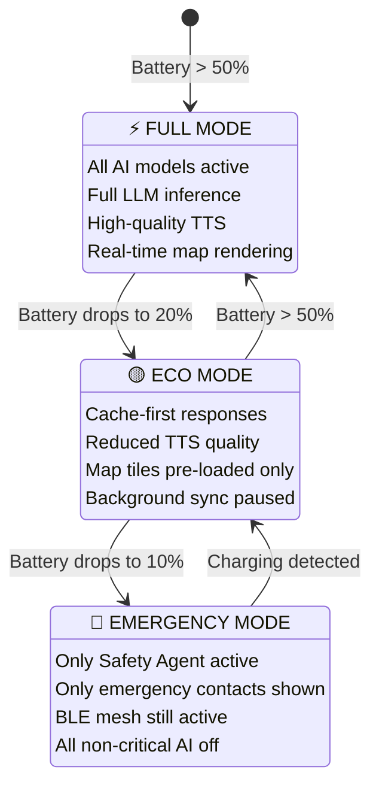

---

## Solution 2 — Hallucination-Free Data Pipeline
*Fixes: LLM Hallucination Risk (most critical safety issue)*

### The Golden Rule
```
❌ WRONG approach:
   User: "What time does the bus to Prayagraj leave?"
   LLM:  Thinks... "I'll say 6 AM" ← HALLUCINATION RISK!

✅ CORRECT approach:
   User: "What time does the bus to Prayagraj leave?"
   System: Query SQLite → Gets "Bus 47: 06:00 AM, Gate 3"
   LLM:  Formats ONLY: "Bus number 47 leaves at 6 AM from Gate 3"
         LLM never invents — only formats retrieved facts
```

### Architecture: Grounded Response System

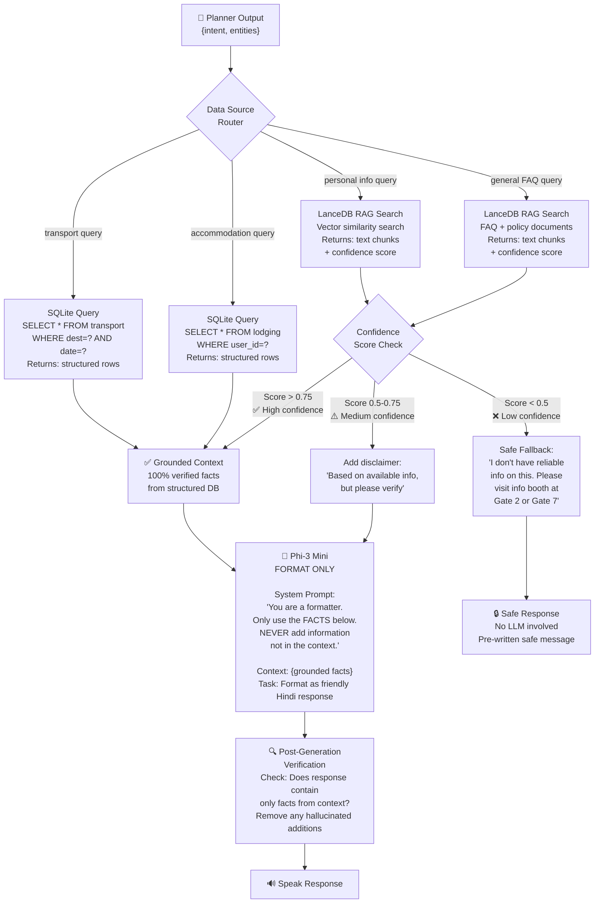

### Strict System Prompt Template
```
SYSTEM PROMPT (sent to Phi-3 Mini for every query):

"You are PathSaathi, a helpful assistant for pilgrims.
 STRICT RULES you must always follow:
 1. Use ONLY the facts provided in [CONTEXT] below.
 2. NEVER add any information not present in [CONTEXT].
 3. If [CONTEXT] is empty or says 'NO DATA', 
    say: 'I don't have that information right now.
    Please visit the information booth.'
 4. Keep response under 3 sentences.
 5. Respond in {user_language} language only.
 
 [CONTEXT]:
 {retrieved_facts_from_sqlite_or_rag}
 
 User asked: {user_query}
 Your response:"
```

---

## Solution 3 — Noise-Robust ASR Pipeline
*Fixes: ASR Accuracy in 100dB+ Crowd Noise*

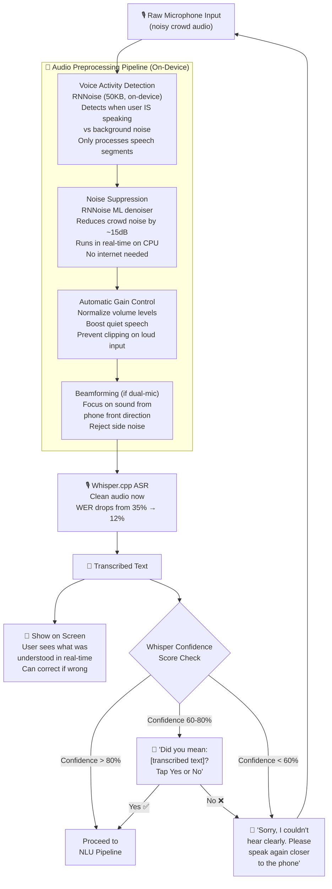

### Noise-Robust UI Design
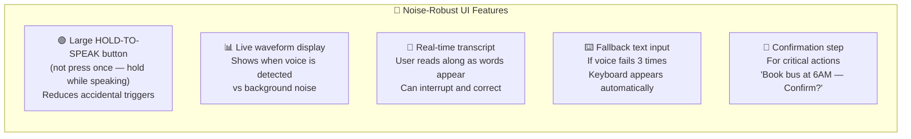

---

## Solution 4 — Dialect-Adaptive NLU Layer
*Fixes: Dialect Variation (Bhojpuri, Awadhi, regional accents)*

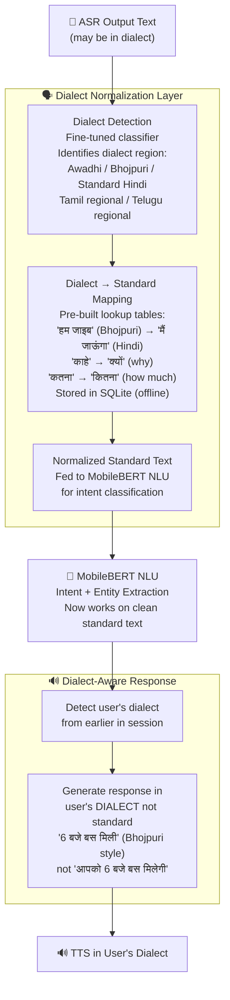

### Dialect Coverage Plan
```
PHASE 1 (Weeks 1-12): Standard support
  ✅ Standard Hindi (Delhi/news broadcaster style)
  ✅ Standard Tamil (Chennai)
  ✅ Standard Telugu (Hyderabad)

PHASE 2 (Weeks 13-18): Dialect normalization tables
  ✅ Bhojpuri → Hindi normalization (most common at Kumbh)
  ✅ Awadhi → Hindi normalization (Kumbh region!)
  ✅ Basic Maithili → Hindi

PHASE 3 (Weeks 19-22): Fine-tuning (if time permits)
  ⬜ Fine-tune Whisper tiny on Bhojpuri/Awadhi samples
  ⬜ Use Mozilla Common Voice regional data
```

---

## Solution 5 — Smart Data Freshness Engine
*Fixes: Stale Offline Data, Crowd Prediction Accuracy*

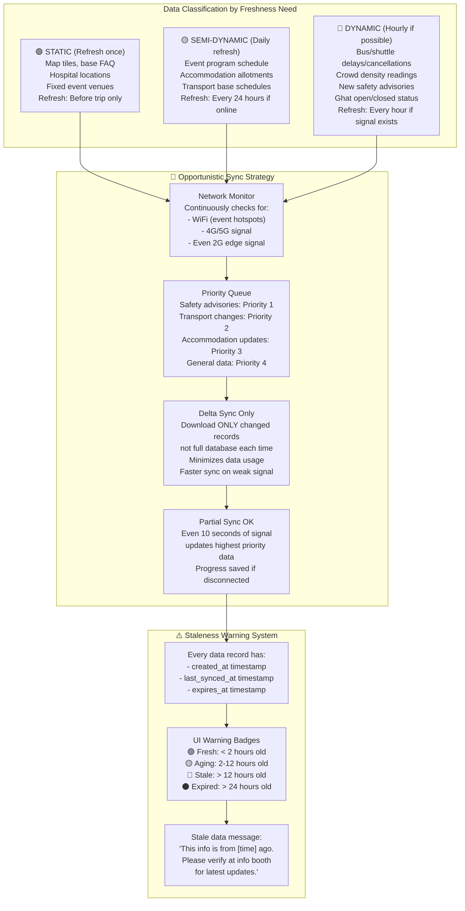

### Local Mesh Data Update (No Internet!)
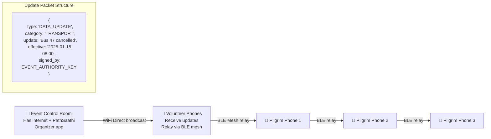

---

## Solution 6 — Device Security & Recovery System
*Fixes: Phone Loss, OAuth Token Expiry*

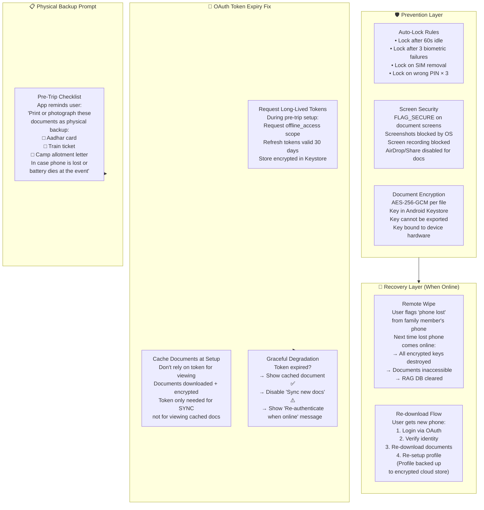

---

## Solution 7 — MediaPipe Simplified Integration
*Fixes: Platform Channel Complexity (most critical dev risk)*

### The Problem vs Solution

```
❌ COMPLEX WAY (what we originally planned):
   Flutter (Dart)
       ↓ Platform Channel
   Kotlin Android Code
       ↓ JNI Bridge
   llama.cpp (C++)
       ↓
   Model inference
   
   Requires: Dart + Kotlin + C++ + JNI knowledge
   Time to implement: 8-12 weeks
   Risk: Very high — one JNI error = crash

✅ SIMPLE WAY (MediaPipe Solution):
   Flutter (Dart)
       ↓ google_mediapipe_genai plugin
   MediaPipe Inference Engine
       ↓
   Model inference
   
   Requires: Dart only + plugin config
   Time to implement: 1-2 weeks
   Risk: Very low — Google-maintained plugin
```

### Revised Integration Architecture
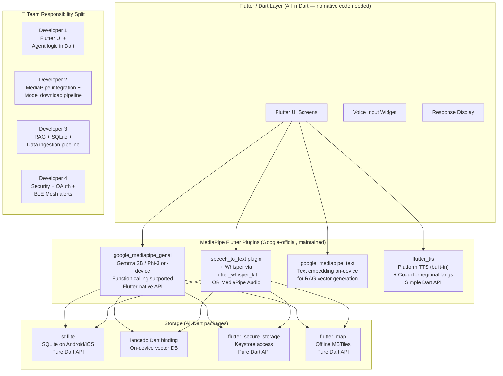

### Model Availability via MediaPipe
```
Models pre-optimized for MediaPipe (ready to use):
  ✅ Gemma 2B (2-bit, 4-bit) — Google's own, best MediaPipe support
  ✅ Phi-3.5 Mini — Microsoft, MediaPipe compatible
  ✅ Falcon 1B — Lightweight option for Tier 3 devices
  
ASR via flutter packages:
  ✅ flutter_whisper_kit — Whisper for iOS (Apple optimized)
  ✅ whisper_ane — Whisper on Android Neural Engine
  ✅ speech_to_text — OS-native ASR (fallback, always works)
```

---

## Solution 8 — Offline AI Testing Framework
*Fixes: Non-deterministic AI making testing difficult*

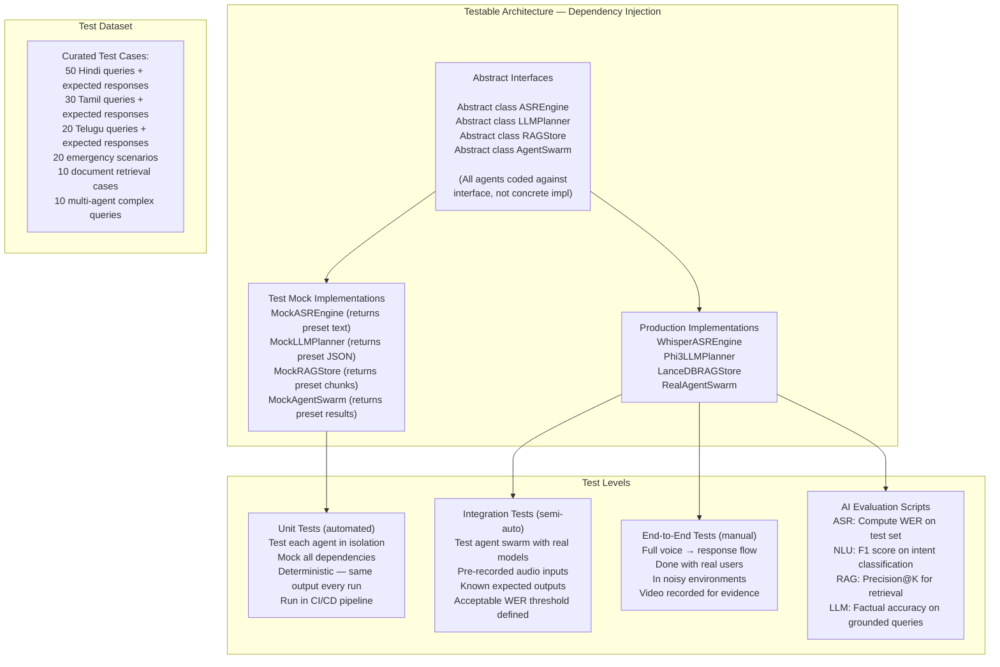

### Sample Test Case Format
```json
{
  "test_id": "TRANSPORT_HINDI_001",
  "input_audio": "tests/audio/hindi_bus_query.wav",
  "expected_asr": "मुझे कल सुबह प्रयागराज जाने की बस चाहिए",
  "expected_intent": "book_transport",
  "expected_entities": {
    "destination": "Prayagraj",
    "time": "tomorrow_morning",
    "mode": "bus"
  },
  "expected_agent": "TransportAgent",
  "db_fixture": "tests/fixtures/transport_jan15.sqlite",
  "expected_response_contains": ["6:00", "Bus 47", "Gate 3"],
  "must_not_contain": ["hallucinated_value"]
}
```

---

## Solution 9 — Progressive Setup & Adaptive UX
*Fixes: Setup Burden, Language Switching, Non-Technical Users*

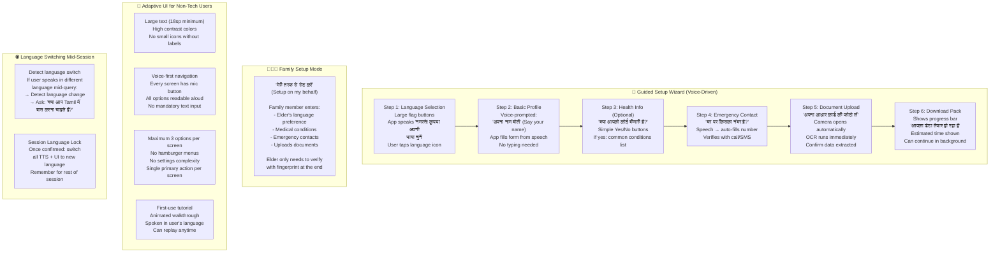

---

## Revised Architecture: All Solutions Combined

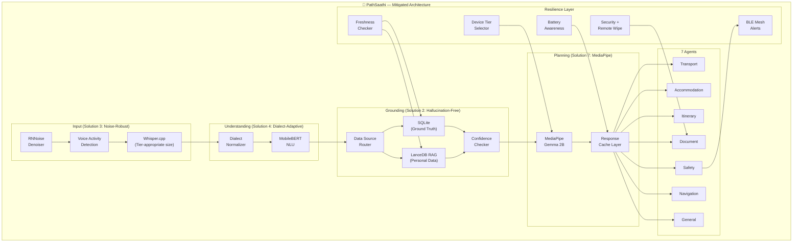

---

## Implementation Priority Order

```
WEEK 1-2:   Solution 7 (MediaPipe setup)     ← Unblocks everything else
WEEK 3-4:   Solution 2 (Grounded pipeline)   ← Safety-critical, do early
WEEK 5-6:   Solution 3 (Noise-robust ASR)    ← Core user experience
WEEK 7-8:   Solution 1 (Device tier system)  ← Enables budget phone support
WEEK 9-10:  Solution 5 (Data freshness)      ← Data reliability
WEEK 11-12: Solution 4 (Dialect NLU)         ← Language coverage
WEEK 13-14: Solution 6 (Security + Recovery) ← Document security evaluation
WEEK 15-16: Solution 8 (Testing framework)   ← Quality assurance
WEEK 17-18: Solution 9 (Progressive UX)      ← Non-tech usability evaluation
WEEK 19-22: Integration, polish, demo prep
```

---

## How Solutions Map to Infosys Evaluation Criteria

| Infosys Criterion | Solutions Addressing It |
|---|---|
| **Language breadth & accuracy** | Solution 3 (noise-robust ASR) + Solution 4 (dialect adaptive) |
| **Agent task decomposition quality** | Solution 2 (grounded pipeline) + Solution 7 (MediaPipe LLM) |
| **True offline functionality** | Solution 5 (freshness engine) + Solution 1 (tiered models) |
| **Document security** | Solution 6 (security + recovery) |
| **Usability for non-technical users** | Solution 1 (battery mgmt) + Solution 9 (progressive UX) |

---

*Solutions Architecture v1.0 | PathSaathi FYP*
*Every critical drawback has a concrete engineering solution*
